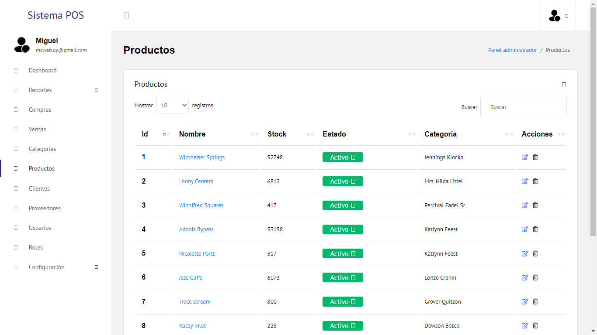

## Name: Point of Sale (POS)
## Description:
Desarrollo de aplicación web para la gestión de negocio, que va desde la administración de productos, proveedores, clientes, ventas, compras, hasta la posibilidad de emitir facturas.
## Platform: Web APP
## Technologies: Laravel - MySQL 
## Version: 1.5.0

## Local Development
### Requerimients
```
PHP
Composer
MySQL
```
### Git Repository
```
git clone https://github.com/migueldev81/laravel-pos
```
### Variables Enviroment (.env)
````
APP_NAME=Laravel
APP_ENV=local
APP_KEY=base64:JVJBGQAIcvuwXYB0ly9k2xJPbdcxZgW/ZsevEuAiPS0=
APP_DEBUG=true
APP_URL=http://localhost

LOG_CHANNEL=stack

DB_CONNECTION=mysql
DB_HOST=127.0.0.1
DB_PORT=3306
DB_DATABASE=laravelpos
DB_USERNAME=root
DB_PASSWORD=

BROADCAST_DRIVER=log
CACHE_DRIVER=array
QUEUE_CONNECTION=sync
SESSION_DRIVER=file
SESSION_LIFETIME=120

REDIS_HOST=127.0.0.1
REDIS_PASSWORD=null
REDIS_PORT=6379

MAIL_MAILER=smtp
MAIL_HOST=smtp.mailtrap.io
MAIL_PORT=2525
MAIL_USERNAME=null
MAIL_PASSWORD=null
MAIL_ENCRYPTION=null
MAIL_FROM_ADDRESS=null
MAIL_FROM_NAME="${APP_NAME}"

AWS_ACCESS_KEY_ID=
AWS_SECRET_ACCESS_KEY=
AWS_DEFAULT_REGION=us-east-1
AWS_BUCKET=

PUSHER_APP_ID=
PUSHER_APP_KEY=
PUSHER_APP_SECRET=
PUSHER_APP_CLUSTER=mt1

MIX_PUSHER_APP_KEY="${PUSHER_APP_KEY}"
MIX_PUSHER_APP_CLUSTER="${PUSHER_APP_CLUSTER}"
````
### SQL Console(No Remote)
````
CREATE DATABASE [DB_DATABASE];
````
### Start Project
```
composer install
```
```
php artisan migrate:refresh --seed
```
```
php artisan serve
```

### Credentials
#### email
admin@admin.com
#### password
admin@12345





