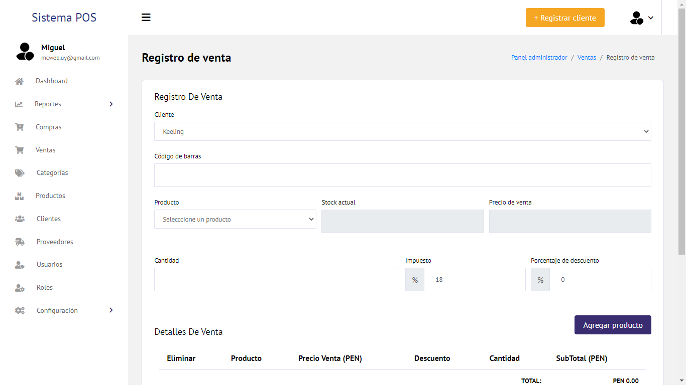
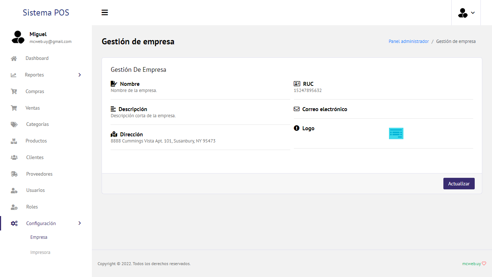

## Name: Point of Sale (POS)
## Description:
Desarrollo de aplicación web para la gestión de negocio, que va desde la administración de productos, proveedores, clientes, ventas, compras, hasta la posibilidad de emitir facturas.
## Platform: Web APP
## Technologies: Laravel - MySQL 
## Version: 1.5.0

## Local Development
### Requerimients
```
PHP
Composer
MySQL
```
### Git Clone
```
https://github.com/migueldev81/laravel-pos
```
### Variables Enviroment (.env)
````
DATABASE
````
### SQL Console(No Remote)
````
CREATE DATABASE [database];
````
### Start Project
```
composer install
```
```
php artisan serve
```







